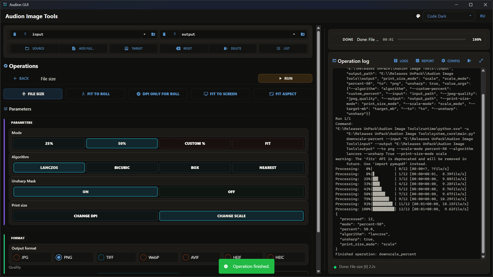

# Audion Image Tools

<!-- audion:release -->
<p align="center">
  <a href="https://audion.dev/downloads/image-tools"></a>
  <a href="https://github.com/Tensionix/image-tools/releases/latest"></a>
  <a href="https://github.com/Tensionix/image-tools/releases"></a>
  <a href="https://github.com/Tensionix/image-tools/blob/main/LICENSE"></a>
</p>

**Version 2.4.2** · 2026-09-04 · 298.1 MB

- [Direct download](https://audion.dev/get/image-tools/2.4.2/Audion_Image_Tools_v2.4.2_Full.zip) — unmetered, no rate limits
- [Project page](https://audion.dev/downloads/image-tools) — every version and how to install

<p align="center"></p>

`SHA-256: 26578413e69e549b78e5eb23d84fe5ab1ad7f2c3e066220218458e64620072d8`

---

An **Audion** tool, published by [Tensionix](https://github.com/Tensionix).
<!-- /audion:release -->


[Русский](Docs/README_RU.md) · [User Guide](Docs/USER_GUIDE_EN.md)

**Contents**

- [Why It Exists](#why-it-exists)
- [Principles](#principles)
- [What It Can Do](#what-it-can-do)
- [Next](#next)
- [Technical Reference](#technical-reference)
  - [Running](#running)
  - [Defaults](#defaults)
  - [Choosing a Colour Profile](#choosing-a-colour-profile)
  - [Folders](#folders)
  - [Workbench Naming](#workbench-naming)

A portable toolkit for images: conversion, colour, sizing, cropping, watermarks,
tiling, contact sheets.

## Why It Exists

Working with images splits into two different jobs, and confusing them is
expensive.

The first is **accept whatever you were given**. A shoot arrives as camera RAW, a
scan as a multi-frame TIFF, a layout as PSD, a phone photo as HEIC. The program
has to open all of it without asking where it came from.

The second is **deliver predictably**. Here the opposite matters: a narrow set of
formats where behaviour is worked out in detail — what happens to transparency,
how the colour profile is written, whether pixels change at all.

Hence the central decision: **wide on the way in, narrow on the way out**. On
input, everything that can be opened. The deep, predictable processing is
concentrated around JPG and PNG.

## Principles

**Three levels of format support are named aloud.** Not "supported", but how
well.

| level | what it means | formats |
|---|---|---|
| stable core | worked out, always works | BMP, GIF, JPG, PNG, TGA, TIFF, WebP, AVIF |
| via adapter | needs an extra layer | HEIC and HEIF, camera RAW — CR2, CR3, DNG |
| best effort | does not always open | WMF, IFF, XIF; PSD as far as it goes |

What is available on a particular machine, the program says itself:

```bat
python system_core\main.py formats
```

**Colour is chosen, not guessed.** sRGB for screens, CMYK for print — and in each
case explicitly: the built-in path with no external file, or a specific profile
from disk. The program will not decide which of the two CMYK profiles you need,
because that depends on the print shop, not on the file.

**Operations that leave pixels alone are kept apart from those that don't.**
Writing resolution changes only the tag in the file; fitting to a roll
recalculates resolution from a size in millimetres while leaving the pixels as
they are. This is stated at each such operation, so you don't later hunt for
where the quality loss came from.

**Compatibility beats compactness.** WebP, AVIF, and HEIF are there for light
delivery, but JPG remains the one that opens everywhere, and the program will not
replace it with them by default.

## What It Can Do

| area | about |
|---|---|
| Conversion | to JPG, PNG, TIFF, WebP, AVIF, HEIF, HEIC; quality by preset or exact value |
| Colour | normalisation with an explicit profile, greyscale, safe transparency handling for JPG |
| Sizing | to 1080p, 1440p, 2160p screens; to 16:9, A4, A3; to a roll by a side in millimetres |
| Resolution | writing a chosen resolution without touching pixels |
| Cropping | a solid border, smart white-background crop, a safety margin in millimetres |
| PDF assembly | straight after cropping, with embedded PNG or JPG |
| Watermark | a caption in the corner or a diagonal protective line, with adjustable opacity and colour |
| Tiling | one image across A5, A4, A3, or a roll — for stickers, with margins and gaps in millimetres |
| Contact sheet | a grid of thumbnails: standard sizes or your own |
| TIFF splitting | multi-frame into numbered PNG frames |
| Rotation | fixing by the orientation tag |

## Next

* [User Guide](Docs/USER_GUIDE_EN.md) — step by step.
* `tools\RELEASE_GUIDE_EN.md` — building a release.

---

## Technical Reference

### Running

```cmd
launcher_gui.cmd          the main one, windowed
launcher_project.cmd      command line and text menu
launcher_project_ru.cmd   the same in Russian
```

The menu uses the quick picker when available and falls back to a plain menu
otherwise. For short, consequential choices it uses a simple list, so values
cannot be confused at deeper steps.

### Defaults

| what | value |
|---|---|
| JPG quality | 83; presets 60, 75, 90; exact values 1 to 100 |
| PNG compression | one preset in the window, a parameter on the command line |
| contact sheet quality | 75 or 92 |
| diagonal caption | about 60 % of the diagonal |

### Choosing a Colour Profile

| task | what to pick |
|---|---|
| screen, website, ordinary delivery | sRGB |
| print | CMYK |
| built-in path without an external file | Pillow sRGB |
| an explicit external reference | the color.org profile |
| broad classic print scenario | `Photoshop5DefaultCMYK.icc` |
| coated print to a specific standard | `CoatedFOGRA39.icc` |

### Folders

```
input\        quick source folder
output\       results
logs\         run logs
report\       detailed reports
workspace\    temporary area
config\       defaults, themes, profile paths
system_core\  the implementation
install\      portable environment
wheelhouse\   packages for offline install
release\      release archives
```

### Workbench Naming

This project's vocabulary is the shared one across all Audion programs:
**Source**, **Add file…**, **Target**, **Reset**, **Delete**, **List**. In
Russian: **Источник**, **Добавить файл…**, **Назначение**, **Сбросить**,
**Удалить**, **Список**.

`Reset` restores the project `input` and `output` without touching files.
`Delete` clears the current source and target only after confirmation. The words
`Destination`, `Clear`, «Цель», and «Очистить» are not used.
